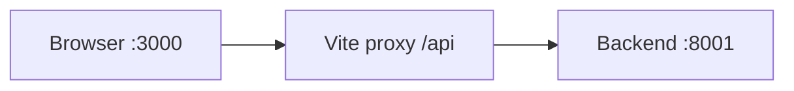
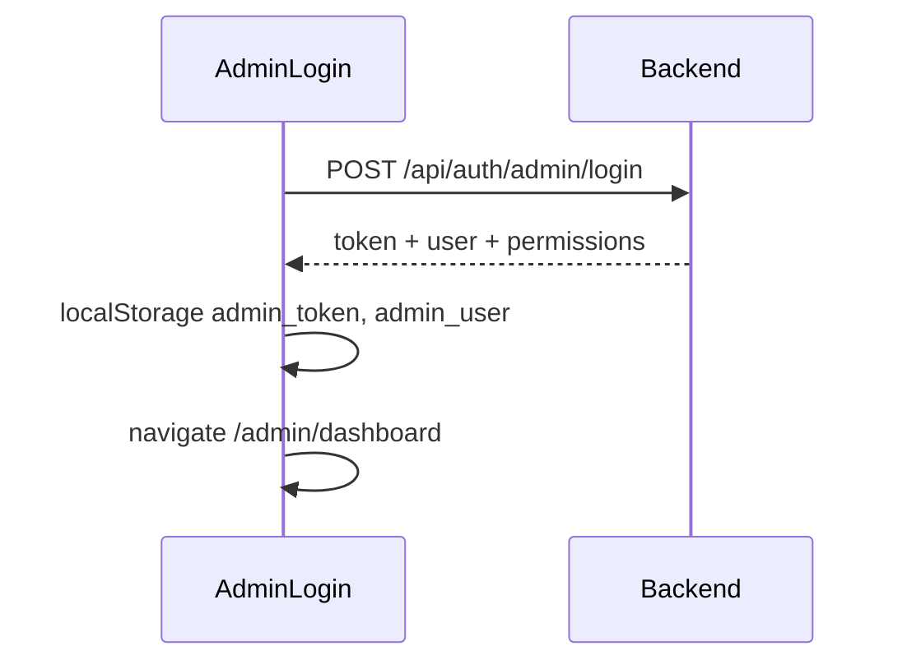

# Farah Admin Dashboard — Complete Guide

This document describes the **admin dashboard** frontend (`admindashboard`): architecture, design system, authentication, API usage, sidebar navigation, and every page (route, purpose, APIs, access, design status).

**Related files:**

- [src/admin/README.md](../src/admin/README.md) — short pointer (update this to link here)
- [src/admin/ADMIN_SEPARATION.md](../src/admin/ADMIN_SEPARATION.md) — admin vs mobile app separation
- [.env.example](../.env.example) — environment variables

---

## 1. Overview

The admin dashboard is a **React + Vite** SPA mounted under `/admin/*`. It is separate from the customer mobile/web flows in `src/pages/`.

| Audience | Description |
|----------|-------------|
| **Platform ADMIN** | Full control: users, vendors, settings, commission, CMS, RBAC |
| **PROVIDER (vendor)** | Approved service providers manage their own venues/services/bookings or specialized modules |
| **Vendor staff** | Log in via admin login; token ties to owner account (`vendorEmployeeId` in JWT) |

**Backend:** [Farah API](../../backend) (default port **8001**).

**Local dev flow:**



| Service | URL / command |
|---------|----------------|
| Backend | `cd backend && npm run dev` → `http://localhost:8001` |
| Frontend | `cd admindashboard && npm run dev` → `http://localhost:3000` |
| Admin login | `http://localhost:3000/admin/login` |

---

## 2. Project structure

```
admindashboard/
├── docs/
│   └── ADMIN_DASHBOARD_GUIDE.md    ← this file
├── src/
│   ├── admin/
│   │   ├── AdminApp.jsx             # All routes + Protected wrapper
│   │   ├── components/            # AdminLayout, AdminPage, tables, modals
│   │   ├── design-system/index.js # Re-exports UI primitives
│   │   ├── pages/                 # 50 page components
│   │   └── utils/
│   │       ├── adminSession.js    # Auth, API_URL, permissions
│   │       └── adminApi.js        # vendorGet / vendorPost helpers
│   ├── components/
│   │   ├── ui/                    # Design system primitives
│   │   └── layout/navConfig.js    # Sidebar menu definitions
│   └── styles/globals.css         # --admin-* tokens, .admin-input, buttons
├── vite.config.js                 # Dev proxy: /api → :8001
└── .env                           # VITE_API_URL=/api
```

| Path | Role |
|------|------|
| [AdminApp.jsx](../src/admin/AdminApp.jsx) | Route table, `Protected` = `AdminRoute` + `PermissionRoute` |
| [AdminLayout.jsx](../src/admin/components/AdminLayout.jsx) | Sidebar, header, notifications, profile, theme |
| [AdminPage.jsx](../src/admin/components/AdminPage.jsx) | Standard shell: layout + `PageHeader` + loading |
| [adminSession.js](../src/admin/utils/adminSession.js) | `readAdminUser`, `adminAuthHeaders`, `API_URL` |
| [adminApi.js](../src/admin/utils/adminApi.js) | Vendor mobile API wrappers |
| [navConfig.js](../src/components/layout/navConfig.js) | Sidebar items + visibility rules |

---

## 3. Design system

### 3.1 Design tokens

Defined in [globals.css](../src/styles/globals.css) under `body.admin-dashboard`:

| Token | Light value | Usage |
|-------|-------------|--------|
| `--admin-bg` | `#f8fafc` | Page background |
| `--admin-surface` | `#ffffff` | Cards, inputs |
| `--admin-sidebar` | `#0f172a` | Sidebar background |
| `--admin-text` | `#1e293b` | Primary text |
| `--admin-text-muted` | `#64748b` | Secondary text |
| `--admin-accent` | `#6366f1` | Primary actions, charts |
| `--admin-success` | `#10b981` | Success states |
| `--admin-warning` | `#f59e0b` | Warnings |
| `--admin-danger` | `#ef4444` | Errors, destructive |
| `--admin-radius-card` | `16px` | Card corners |
| `--admin-radius-control` | `10px` | Inputs, buttons |

**Theme:** Light/dark via `[data-theme]` (`AdminUiThemeProvider` + `ThemeToggle`).

**Typography:** Alexandria (primary), Inter fallback.

**Form controls:** `.admin-input`  
**Buttons:** `.admin-btn`, `.admin-btn-primary`, `.admin-btn-ghost`, `.admin-toolbar-btn`, `.admin-toolbar-btn-accent`

### 3.2 UI primitives (`src/components/ui/`)

| Component | Purpose |
|-----------|---------|
| `StatCard` | KPI metric with optional icon and trend |
| `Card` | Section with optional `title` and `action` slot |
| `PageHeader` | Page title, breadcrumbs, top-right action |
| `ChartContainer` | Measures container before rendering Recharts (fixes size `-1` warnings) |
| `Badge` | Status labels |
| `DataTable` | Tabular data |
| `EmptyState` | Empty list placeholder |
| `Modal` / `Drawer` | Overlays |
| `LoadingSkeleton` | Loading placeholder |
| `SearchInput` | Filter/search field |
| `Avatar`, `ThemeToggle`, `LanguageSwitcher` | Chrome |

Import barrel: [design-system/index.js](../src/admin/design-system/index.js)

### 3.3 Page layout patterns

| Pattern | Used by | Description |
|---------|---------|-------------|
| **Legacy** | ~47 pages | `AdminLayout` only; custom divs, mixed styles |
| **Partial** | `Dashboard.jsx` | `AdminLayout` + `StatCard` / `Card` / `ChartContainer` |
| **New** | `VendorWallet`, `VendorReports` | Full `AdminPage` + design-system components |

**Target standard for new/refactored pages:**

```jsx
import AdminPage from '../components/AdminPage'
import { Card, StatCard } from '../design-system'
import { API_URL, adminAuthHeaders } from '../utils/adminSession'
```

### 3.4 Design migration summary (modern UI)

| Status | Count | Pages |
|--------|-------|-------|
| **Shell + tokens** | 48+ | `AdminPage`, dark sidebar, `admin-modern.css`, Inter |
| **Full modern list UI** | 14+ | Users, Bookings, Vendors, Venues, Services, Categories, Payments, Reviews, Reports, Permissions, Notifications, Dashboard, Roles |
| **CMS (tabs)** | 2 | `/admin/content/legal` (about · privacy · terms), `/admin/content/media` (sliders · onboarding) |
| **Sidebar** | — | Grouped sections via `navConfig.js` (`NAV_SECTION_ORDER`); collapsed 76px / expanded 260px |
| **Form/detail shells** | 15+ | `AdminFormShell` (add/edit), `AdminDetailShell` (booking, slaughter order, wallet) |
| **Legacy CMS redirects** | 5 | About/Privacy/Terms/Sliders/Onboarding → tabbed content routes |
| **Minor polish** | few | Invoice print, VendorTeam, VendorsMap — breadcrumbs added, some modals retain old styles |

Shared components: `UiCard`, `UiStats`, `UiTable`, `ModernListPage`, `SearchInput`, pill `Badge`.

Styles: [admin-modern.css](../src/styles/admin-modern.css)

Many legacy pages still use `http://localhost:8001/api` as fallback instead of `/api` — prefer `API_URL` from `adminSession.js`.

---

## 4. Authentication and roles

### 4.1 Login flow



- **File:** [AdminLogin.jsx](../src/admin/pages/AdminLogin.jsx)
- **API:** `POST /api/auth/admin/login`, optional `GET /api/settings` (dashboard logo)
- **Storage:** `admin_token`, `admin_user`

### 4.2 Session helpers ([adminSession.js](../src/admin/utils/adminSession.js))

| Function | Purpose |
|----------|---------|
| `readAdminUser()` | Parse `admin_user` from localStorage |
| `getAdminToken()` | Read `admin_token` |
| `adminAuthHeaders()` | `{ Authorization: Bearer ... }` |
| `isFullAdminUser()` | `role === 'ADMIN'` or `isFullAdmin === true` |
| `usesProviderApis()` | `PROVIDER` and not full admin |
| `isSlaughterOnlyVendor()` | `vendorType === 'SLAUGHTER_PROVIDER'` |
| `isVenueOnlyVendor()` | `vendorType === 'VENUE_PROVIDER'` |
| `hasPermission(resource, action)` | RBAC check from login payload |
| `getSlaughterApiMode()` | Admin vs vendor slaughter API base paths |
| `getVenueVendorApiMode()` | Venue vendor booking/invoice APIs |

### 4.3 Who sees what

| User | Sidebar / routes |
|------|------------------|
| **ADMIN** | Full platform (users, vendors, settings, commission, CMS, RBAC) |
| **PROVIDER** (general) | Venues, services, bookings, reviews; APIs often `/api/provider/*` |
| **PROVIDER + SLAUGHTER_PROVIDER** | Slaughter module only; marketplace items hidden |
| **PROVIDER + VENUE_PROVIDER** | Venue bookings, venue invoices + dashboard |
| **Provider portal** (wallet, reports, team, settings) | **Vendors only** — hidden from platform admin |

Route guards: [AdminRoute.jsx](../src/admin/components/AdminRoute.jsx) validates token; [PermissionRoute.jsx](../src/admin/components/PermissionRoute.jsx) enforces `requireFullAdmin`, `vendorTypesOnly`, `hideForVendorTypes`, `providerPortal`.

---

## 5. API integration

### 5.1 Base URL

| Environment | Config | Effective calls |
|-------------|--------|-----------------|
| Development | `VITE_API_URL=/api` in [.env](../.env) | `http://localhost:3000/api/...` → proxied to `:8001` |
| Production | [.env.production](../.env.production) | Full URL e.g. `https://farah.nodeteam.site/api` |

### 5.2 API families

| Prefix | Used for |
|--------|----------|
| `/api/auth/admin/*` | Login, session (`/me`) |
| `/api/admin/*` | Platform admin CRUD |
| `/api/provider/*` | Provider-scoped dashboard data |
| `/api/mobile/vendor/*` | Vendor wallet, team, profile, slaughter (vendor token) |
| `/api/admin/slaughter/*` | Admin slaughter management |
| `/api/settings` | Public/app settings (logo, currency) |
| `/api/content/*` | About, privacy, terms |
| `/api/notifications` | Admin notifications |
| `/api/sliders`, `/api/onboarding` | CMS |
| `/api/reports` | Generated reports (admin reports page) |
| `/api/roles`, `/api/permissions` | RBAC |

### 5.3 Vendor API helper ([adminApi.js](../src/admin/utils/adminApi.js))

```js
vendorGet('/wallet')           // → GET /api/mobile/vendor/wallet
vendorPost('/withdrawals', {}) // → POST /api/mobile/vendor/withdrawals
```

Always uses fresh `adminAuthHeaders()` (avoids stale token in `useMemo`).

---

## 6. Sidebar navigation

Defined in [navConfig.js](../src/components/layout/navConfig.js), filtered by `filterAdminNav(user)`.

| Rule | Effect |
|------|--------|
| `requireFullAdmin` | Only platform ADMIN |
| `hideForVendorTypes` | Hidden for listed vendor types (e.g. slaughter) |
| `vendorTypesOnly` | Only shown to matching `vendorType` |
| `providerPortal` | **Vendors only** (`PROVIDER`, not platform admin) |
| `permission` | Requires RBAC permission unless full admin |

---

## 7. Page catalog

**Design column:** `New` = `AdminPage` + design-system; `Partial` = some UI primitives; `Legacy` = `AdminLayout` + custom markup.

**Access:** `Admin` = platform admin; `Provider` = approved vendor; `Slaughter` / `Venue` = vendor type.

---

### 7.1 Public

| Route | File | Purpose | Primary APIs | Access | Design |
|-------|------|---------|--------------|--------|--------|
| `/admin/login` | AdminLogin.jsx | Email/password login; loads dashboard logo | `POST /auth/admin/login`, `GET /settings` | Public | Legacy |

---

### 7.2 Core

| Route | File | Purpose | Primary APIs | Access | Design |
|-------|------|---------|--------------|--------|--------|
| `/admin/dashboard` | Dashboard.jsx | KPIs, charts, quick links; admin vs provider stats | `GET /admin/stats` or `GET /provider/dashboard/stats` | Admin, Provider | Partial |
| `/admin/settings` | Settings.jsx | App settings (currency, logos, commission, Stripe) | `GET/PATCH /settings` | Admin | Legacy |
| `/admin/notifications` | NotificationsPage.jsx | List, mark read, delete notifications | `GET/PATCH/DELETE /notifications` | Admin | Legacy |

---

### 7.3 Users and RBAC

| Route | File | Purpose | Primary APIs | Access | Design |
|-------|------|---------|--------------|--------|--------|
| `/admin/users` | Users.jsx | List/create/edit users, activate/deactivate | `GET/POST/PATCH/DELETE /admin/users` | Admin | Legacy |
| `/admin/users/customers` | Users.jsx (`defaultRole=CUSTOMER`) | Same as users, filtered to customers | Same | Admin | Legacy |
| `/admin/roles` | Roles.jsx | Roles and permission assignment | `GET /roles`, `/permissions`, role permission CRUD | Admin | Legacy |
| `/admin/permissions` | Permissions.jsx | Manage permission definitions | `GET/POST/PATCH/DELETE /permissions` | Admin | Legacy |

---

### 7.4 Marketplace — Venues

| Route | File | Purpose | Primary APIs | Access | Design |
|-------|------|---------|--------------|--------|--------|
| `/admin/venues` | Venues.jsx | List venues; toggle status; delete | `GET /admin/venues` or `GET /provider/venues`, `PATCH .../status` | Admin, Provider | Legacy |
| `/admin/venues/add` | AddVenue.jsx | Create venue (multipart images) | `POST /admin/venues` | Admin | Legacy |
| `/admin/venues/:id/edit` | EditVenue.jsx | Edit venue, link services | `GET/PUT /admin/venues/:id` | Admin | Legacy |
| `/admin/venues/:id/calendar` | VenueBookingCalendar.jsx | Calendar, holidays, booking actions | `GET .../bookings-calendar`, holidays, bookings | Admin | Legacy |
| `/admin/venues/:id/settings` | VenueSettings.jsx | Working hours and pricing | `GET/PATCH .../working-hours`, `.../pricing` | Admin | Legacy |

---

### 7.5 Marketplace — Services

| Route | File | Purpose | Primary APIs | Access | Design |
|-------|------|---------|--------------|--------|--------|
| `/admin/services` | Services.jsx | List/create/edit services inline | `GET /admin/services` or `/provider/services`, CRUD | Admin, Provider | Legacy |
| `/admin/services/add` | AddService.jsx | Add service form | `POST /admin/services` | Admin | Legacy |

---

### 7.6 Marketplace — Categories

| Route | File | Purpose | Primary APIs | Access | Design |
|-------|------|---------|--------------|--------|--------|
| `/admin/categories` | Categories.jsx | Service categories list | `GET /admin/categories`, `DELETE` | Admin | Legacy |
| `/admin/categories/add` | AddCategory.jsx | Create category (icon/image) | `POST /admin/categories` | Admin | Legacy |
| `/admin/categories/:id/edit` | EditCategory.jsx | Edit category | `GET/PATCH /admin/categories/:id` | Admin | Legacy |

---

### 7.7 Marketplace — Bookings

| Route | File | Purpose | Primary APIs | Access | Design |
|-------|------|---------|--------------|--------|--------|
| `/admin/bookings` | Bookings.jsx | List bookings; update status/payment | `GET /admin/bookings` or `/provider/bookings`, `PATCH` | Admin, Provider | Legacy |
| `/admin/bookings/:id` | BookingDetails.jsx | Booking detail; status & payment (admin only for patch) | `GET` admin or provider bookings | Admin, Provider | Legacy |
| `/admin/bookings/:id/invoice` | Invoice.jsx | Printable/PDF invoice for booking | `GET` booking by id | Admin, Provider | Legacy |

---

### 7.8 Marketplace — Reviews and payments

| Route | File | Purpose | Primary APIs | Access | Design |
|-------|------|---------|--------------|--------|--------|
| `/admin/reviews` | Reviews.jsx | List/delete reviews | `GET/DELETE /admin/reviews` or `/provider/reviews` | Admin, Provider | Legacy |
| `/admin/payments` | Payments.jsx | Payment records; update status | `GET/PATCH /admin/payments` | Admin | Legacy |
| `/admin/reports` | Reports.jsx | Generate/download/delete report files | `GET/POST /reports`, download | Admin | Legacy |

---

### 7.9 Vendors (platform admin)

| Route | File | Purpose | Primary APIs | Access | Design |
|-------|------|---------|--------------|--------|--------|
| `/admin/vendors` | Vendors.jsx | Approve/reject/suspend vendors; recent orders | `GET /admin/vendors`, `PATCH approve/reject/suspend` | Admin | Legacy |
| `/admin/vendors/:id` | VendorDetails.jsx | Vendor profile, branches, orders, transactions | `GET/PATCH /admin/vendors/:id`, locations | Admin | Legacy |
| `/admin/vendors-map` | VendorsMap.jsx | Map of vendor locations | `GET /admin/vendors-map` | Admin | Legacy |
| `/admin/wallets` | VendorWallets.jsx | All vendor wallets; freeze, adjust, send money | `GET /admin/wallets`, freeze/activate, send-money | Admin | Legacy |
| `/admin/wallets/:walletId` | WalletDetails.jsx | Single wallet + transactions | `GET /admin/wallets/:id`, vendor transactions | Admin | Legacy |
| `/admin/commission` | CommissionReports.jsx | Platform commission reports | `GET /admin/commission/reports` | Admin | Legacy |

---

### 7.10 Provider portal (vendor-only)

| Route | File | Purpose | Primary APIs | Access | Design |
|-------|------|---------|--------------|--------|--------|
| `/admin/vendor/wallet` | VendorWallet.jsx | Balance, payouts, bank accounts, withdrawals | `/api/mobile/vendor/wallet/*` via `adminApi` | Provider | **New** |
| `/admin/vendor/reports` | VendorReports.jsx | Financial report, export JSON/CSV | `/api/mobile/vendor/wallet`, `financial-report` | Provider | **New** |
| `/admin/vendor/team` | VendorTeam.jsx | Manage vendor staff accounts | `/api/mobile/vendor/team` | Provider | Legacy |
| `/admin/vendor/settings` | VendorProfileSettings.jsx | Profile and password; quick links | `/api/mobile/vendor/profile` | Provider | Legacy |

---

### 7.11 Venue provider module

| Route | File | Purpose | Primary APIs | Access | Design |
|-------|------|---------|--------------|--------|--------|
| `/admin/venue/bookings` | VenueBookings.jsx | Venue provider booking list | `GET /api/mobile/vendor/venue/bookings` | Venue provider | Legacy |
| `/admin/venue/bookings/:id` | VenueBookingDetail.jsx | Detail, status, create invoice | `GET/PATCH` venue bookings, `POST` invoices | Venue provider | Legacy |
| `/admin/venue/invoices` | VenueInvoices.jsx | Invoice archive | Admin or `/api/mobile/vendor/venue/invoices` | Venue provider, Admin | Legacy |

---

### 7.12 Slaughter module

| Route | File | Purpose | Primary APIs | Access | Design |
|-------|------|---------|--------------|--------|--------|
| `/admin/slaughter/categories` | SlaughterCategories.jsx | Slaughter categories CRUD | Admin or vendor slaughter categories | Admin, Slaughter | Legacy |
| `/admin/slaughter/products` | SlaughterProducts.jsx | Products list; approve (admin) | Admin or vendor slaughter products | Admin, Slaughter | Legacy |
| `/admin/slaughter/products/add` | AddSlaughterProduct.jsx | Add product | `POST` slaughter products | Slaughter | Legacy |
| `/admin/slaughter/products/:id/edit` | AddSlaughterProduct.jsx | Edit product (same component) | `PUT` product | Slaughter | Legacy |
| `/admin/slaughter/products/:id` | SlaughterProductDetails.jsx | Product detail view | `GET` product | Admin, Slaughter | Legacy |
| `/admin/slaughter/products/calculator` | SlaughterProductsCalculator.jsx | Order calculator | categories, products, calculate | Slaughter | Legacy |
| `/admin/slaughter/orders` | SlaughterOrders.jsx | Order list; update status | Admin or vendor slaughter orders | Admin, Slaughter | Legacy |
| `/admin/slaughter/orders/:orderId` | SlaughterOrderDetail.jsx | Order detail, invoice, print/PDF | `GET` order, `POST` vendor invoices | Admin, Slaughter | Legacy |
| `/admin/slaughter/invoices` | SlaughterInvoices.jsx | Slaughter invoice archive | Admin or vendor slaughter invoices | Admin, Slaughter | Legacy |
| `/admin/slaughter/team` | — | Redirects to `/admin/vendor/team` | — | — | — |

`getSlaughterApiMode()` in code chooses admin vs vendor API paths per user.

---

### 7.13 CMS and content

| Route | File | Purpose | Primary APIs | Access | Design |
|-------|------|---------|--------------|--------|--------|
| `/admin/content/legal?tab=about\|privacy\|terms` | content/LegalPages.jsx | About, privacy, terms (tabs) | `GET/PATCH /content/{tab}` | Admin | Modern |
| `/admin/content/media?tab=sliders\|onboarding` | content/AppMediaPages.jsx | Sliders + onboarding (tabs) | `/sliders`, `/onboarding` | Admin | Modern |
| `/admin/about`, `/privacy`, `/terms` | — | Redirect → `content/legal?tab=…` | — | Admin | — |
| `/admin/sliders`, `/onboarding` | — | Redirect → `content/media?tab=…` | — | Admin | — |

---

## 8. Shared admin components (`src/admin/components/`)

| Component | Purpose |
|-----------|---------|
| `AdminLayout` | Main chrome: sidebar from `navConfig`, header, notifications bell, profile menu |
| `AdminPage` | Wrapper: `AdminLayout` + `PageHeader` + loading skeleton |
| `AdminRoute` | Auth gate; redirects to login |
| `PermissionRoute` | RBAC / vendor-type / full-admin gates |
| `ResponsiveTable` / `TableHeader` | Data tables |
| `Pagination`, `FilterSelect`, `SearchInput` | List tooling |
| `ActionButtons`, `BulkActions` | Row actions |
| `ConfirmDialog`, `Modal` | Confirmations (admin-specific modal duplicate exists) |
| `Notifications` | Header notification dropdown |
| `MapPreview` | Leaflet map embed |

---

## 9. Internationalization (i18n)

- UI strings use **react-i18next** (`t('nav.dashboard')`, etc.)
- RTL supported when language is Arabic (`i18n.language === 'ar'`)
- Sidebar labels map to keys in `nav.*`, page titles in feature namespaces (`dashboard.*`, `vendorWallet.*`, `slaughter.*`, …)

---

## 10. Local development checklist

1. Start MySQL and ensure backend `.env` has `DATABASE_URL`, `PORT=8001`, `JWT_SECRET`.
2. `cd backend && npm run dev`
3. `cd admindashboard && npm run dev`
4. Open `http://localhost:3000/admin/login`
5. After changing `.env`, restart Vite and hard-refresh (`Ctrl+Shift+R`)

**Common console messages (safe to ignore in dev):**

- React DevTools download hint
- Stripe.js HTTP warning on localhost
- Recharts size warnings — fixed on Dashboard via `ChartContainer`; other charts may still warn until migrated

---

## 11. Roadmap — design system rollout

Suggested order to align all pages with the same system:

| Phase | Pages | Work |
|-------|-------|------|
| **A** | Bookings, Users, Vendors, Settings | `AdminPage` + replace hardcoded API URLs |
| **B** | Venues, Services, Categories, Payments, CommissionReports | `Card`, `DataTable`, shared toolbar buttons |
| **C** | Slaughter + venue provider + CMS | Same pattern as VendorWallet/Reports |

---

## 12. Changelog (documentation)

| Date | Note |
|------|------|
| 2026-06-04 | Initial comprehensive guide |
| 2026-06-04 | Modern UI: 8 full list pages + global `ui-table` / legacy CSS overrides |

---

*Maintainers: update this file when adding routes or completing design-system migration for a page.*
